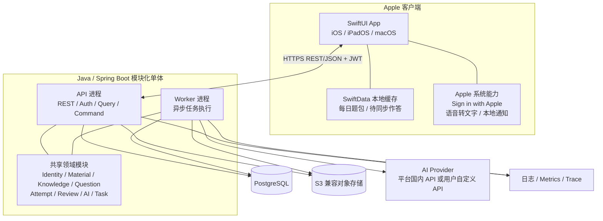
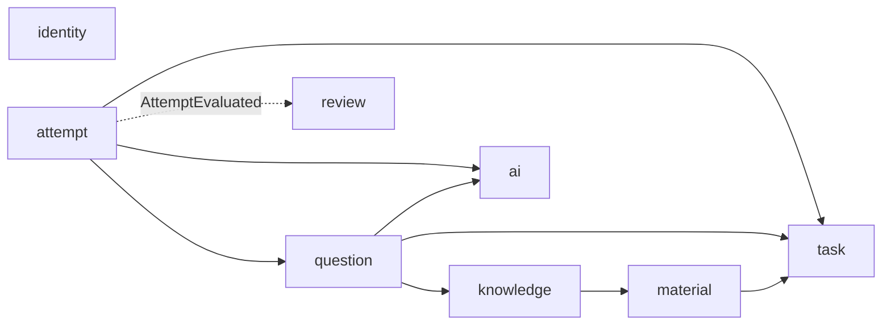
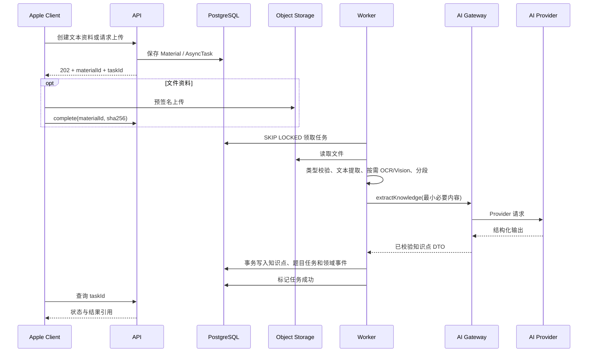
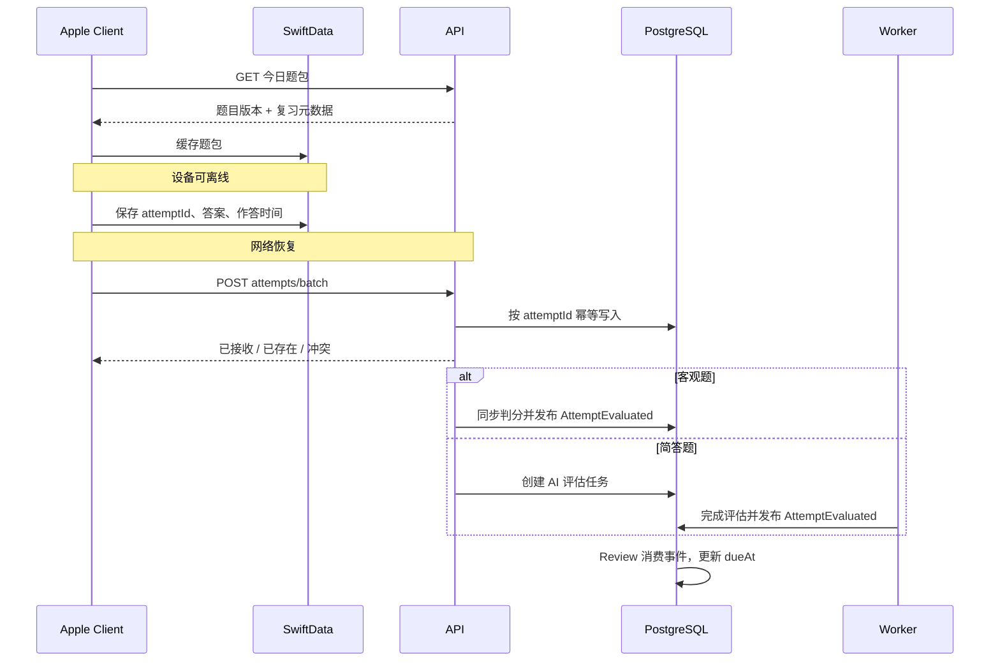
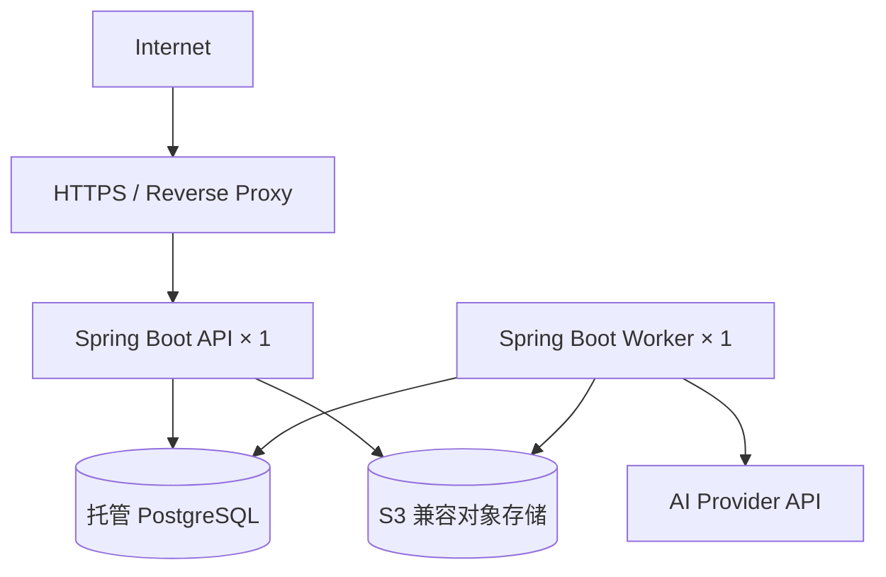

# Daily Reflection 系统架构设计

> 状态：已确认设计基线  
> 日期：2026-07-31  
> 适用范围：一期个人 MVP  
> 需求基线：[PRD](../../PRD.md)  
> UI 基线：[UI 设计稿](../../ui-design.excalidraw)

## 1. 文档目的

本文定义 Daily Reflection 一期的系统边界、技术架构、模块职责、核心数据流、安全约束、测试策略和部署方式，作为 Apple 客户端与 Java 服务端的共同实施基线。

一期验证以下核心闭环：

1. 用户输入文本，或上传 PDF、Markdown、JPG、PNG 资料。
2. 系统解析资料并调用 AI 提取原子知识点。
3. 系统根据知识点生成题目。
4. 用户获取每日题包，在线或离线答题。
5. 服务端判分或异步进行 AI 评估，并更新后续复习计划。

本文不包含页面视觉细节、Prompt 正文、完整 OpenAPI Schema、数据库 DDL 和精确复习算法参数。这些内容应在实施阶段分别沉淀为接口契约、数据库迁移、Prompt 版本和复习策略配置，但不得突破本文定义的边界。

## 2. 已确认的架构决策

| 主题 | 决策 | 原因 |
|---|---|---|
| 产品阶段 | 个人 MVP | 优先验证学习闭环，控制开发和运维成本 |
| 客户端 | Swift + SwiftUI | 一套原生代码覆盖 iOS、iPadOS、macOS |
| 客户端架构 | MVVM + Swift Concurrency | 与 Apple 平台生态一致，便于状态隔离和测试 |
| 服务端 | Java + Spring Boot 模块化单体 | 业务边界清晰，同时避免过早微服务化 |
| 运行形态 | 同一代码库、API/Worker 双进程 | 长任务与同步请求隔离，仍可共享领域实现 |
| 数据库 | PostgreSQL | 支持事务、JSON、全文检索和可靠任务领取 |
| 文件存储 | S3 兼容对象存储 | 避免大文件进入关系数据库，保持云厂商中立 |
| 异步机制 | PostgreSQL 持久化任务队列 | MVP 无需独立消息中间件，进程重启不丢任务 |
| 身份认证 | Sign in with Apple + 自有 JWT | 适配 Apple 生态，并保持业务 API 认证稳定 |
| AI 接入 | AI Gateway + Provider Adapter | 平台默认国内模型与用户自定义模型可替换 |
| 自定义模型 | 一期支持 OpenAI-compatible HTTPS API | 兼容面广且能限制一期实现范围 |
| 语音输入 | Apple 端转文字，服务端只接收文本 | 不上传或保存原始音频，降低隐私和存储复杂度 |
| 每日提醒 | Apple 本地通知 | 一期不建设服务端 APNs 调度系统 |
| 离线能力 | 已下载题包可离线作答，联网后同步 | 支持碎片化使用，不承担完整离线编辑复杂度 |
| 部署 | Docker、云厂商中立、托管数据服务优先 | 便于本地开发和低成本上线 |

## 3. 范围

### 3.1 一期包含

- Sign in with Apple 登录和多设备会话。
- 文本、Markdown、PDF、JPG、PNG 资料输入。
- Apple 端语音转文字后的文本输入。
- 资料解析、必要时 OCR 或 Vision 识别。
- AI 知识点提取、题目生成和简答评估。
- 知识点查看、编辑、合并、删除和标签管理。
- 单选、多选、填空、简答题。
- 每日题包、掌握度和版本化间隔重复策略。
- 已下载题包离线作答和联网后幂等同步。
- 平台默认国内 AI Provider。
- 用户自定义 OpenAI-compatible AI Profile。
- 本地通知、统计概览和薄弱知识点。

### 3.2 一期不包含

- Android、Web、Windows 客户端。
- 团队空间、内容分享和多人协作。
- 知识图谱查询或可视化。
- 原始音频上传、存储、服务端 ASR 或口述答题。
- 完整离线资料库、离线编辑与多设备冲突合并。
- 服务端 APNs 定时推送平台。
- 微服务、Kubernetes、RabbitMQ、Kafka、Redis。
- 任意脚本式 AI Provider 或任意协议插件。

当明确的容量、可靠性或组织边界证明现有设计不足时，才能通过 ADR 引入上述基础设施。

## 4. 总体架构



### 4.1 运行单元

- `api`：处理身份认证、同步业务 API、查询、上传凭证和任务状态。
- `worker`：领取持久化任务，执行资料解析、AI 调用、题目生成和简答评估。
- 两者由同一份代码和同一镜像构建，通过启动参数选择运行模式。
- API 请求链禁止直接执行 OCR、文档解析或 AI 调用。
- API 与 Worker 可独立重启和扩容。

### 4.2 模块化单体约束

- 模块间只能通过公开的 Application Service、只读 Query Service 或领域事件协作。
- 模块不得直接引用其他模块的 Repository、数据库 Entity 或内部 Service。
- 每张业务表只有所属模块可以写入。
- 跨模块查询由明确的 Query Service 组合 DTO，不共享持久化 Entity。
- 使用 Spring Modulith 测试持续验证模块依赖方向。
- 每个模块内部采用 `api / application / domain / infrastructure` 分层，不建立全局 `controller/service/repository` 大目录。

## 5. 服务端模块

### 5.1 `identity`

职责：

- 校验 Apple `identityToken`。
- 管理用户和外部身份关联。
- 签发短期 Access Token 与可轮换 Refresh Token。
- 管理设备级会话、注销和撤销。

约束：

- 校验 Apple Token 的签名、`iss`、`aud`、`exp` 和 `nonce`。
- 使用 Apple `sub` 作为稳定外部身份，不以邮箱作为主标识。
- Refresh Token 只存哈希，轮换后旧 Token 立即失效。

### 5.2 `material`

职责：

- 管理文本和文件资料。
- 管理标签、对象键、内容哈希、MIME Type 和解析状态。
- 保存页码、段落、文本偏移等来源定位信息。
- 生成预签名上传和下载信息。
- 编排资料删除。

### 5.3 `knowledge`

职责：

- 管理原子知识点、来源引用和标签。
- 支持编辑、合并、删除和版本记录。
- 提供知识点掌握度只读视图。

知识点必须可以追溯到资料中的页码、段落或文本偏移；AI 生成但无法定位来源的内容应标记为低置信度，不得伪造引用。

### 5.4 `question`

职责：

- 管理题干、题型、选项、标准答案、解析和版本。
- 维护题目与知识点之间的关联。
- 发起和接收 AI 出题任务。
- 标记错误题、停用题和重新生成关系。

### 5.5 `attempt`

职责：

- 接收在线和离线作答。
- 通过客户端生成的 `attemptId` 保证幂等。
- 同步判定客观题。
- 创建简答题 AI 评估任务。
- 保存评分、反馈、作答耗时和题目版本快照。

### 5.6 `review`

职责：

- 生成每日题包。
- 管理知识点复习状态、到期时间和连续打卡。
- 消费 `AttemptEvaluated` 领域事件并更新下一次复习时间。
- 为 Apple 客户端提供本地通知所需的下一次到期摘要。

一期采用版本化的 `SM2_LITE_V1` 策略：复习状态至少保存 `strategyVersion`、`repetition`、`easeFactor`、`intervalDays`、`dueAt` 和 `lastScore`。具体参数由配置固定并通过单元测试锁定；未来算法调整必须新增策略版本，历史记录不得被新公式静默重算。

### 5.7 `ai`

职责：

- 管理 AI Profile、Provider 能力和连接测试。
- 提供知识提取、题目生成、简答评估和文档识别能力接口。
- 管理 Prompt 版本、结构化输出 Schema、调用记录和安全脱敏。
- 实现平台 Provider 与 OpenAI-compatible Adapter。

AI 模块不得自行查询资料或其他领域表。调用方必须传入最小必要 DTO，AI 模块只返回结构化结果。

### 5.8 `task`

职责：

- 管理持久化异步任务状态。
- 提供任务领取、租约、续租、重试、取消和失败归档。
- 暴露任务进度和安全错误信息。

`task` 只负责编排，不包含知识提取、出题、判分等业务规则。

### 5.9 依赖方向



`review` 不反向调用 `attempt`。事件处理失败时通过可重试事件记录恢复，不依赖进程内瞬时事件。

## 6. Apple 客户端架构

### 6.1 分层

- **Presentation**：SwiftUI View，只负责渲染状态和发送用户意图。
- **Feature/ViewModel**：按 Today、Library、Knowledge、Quiz、Statistics、Settings 划分。
- **Domain**：客户端用例和不依赖 UI 的业务模型。
- **Data**：Remote API、SwiftData、本地同步队列和认证状态。
- **Platform**：Sign in with Apple、Speech、UserNotifications、Keychain 和网络状态。

### 6.2 本地数据边界

SwiftData 只保存客户端需要的离线投影：

- 已下载的每日题包和题目版本。
- 待同步作答及其 `attemptId`。
- 复习摘要和通知计划。
- 最小必要的资料与知识点列表缓存。

SwiftData Model 不与服务端表一一映射。服务端 DTO 与本地模型通过 Mapper 转换，以便双方独立迁移。

### 6.3 语音输入

- 用户可直接输入文字，或使用 Apple 系统语音能力在设备端转成文字。
- 客户端只将用户确认后的文字发送到服务端。
- 服务端不接收、不保存原始音频。
- 文字资料需要联网调用 AI 解析；断网时可保存本地草稿，但不声称已经完成解析。

### 6.4 本地通知

- 客户端根据服务端同步的 `dueAt` 和用户偏好安排 UserNotifications。
- 每次同步复习计划后重新计算通知。
- 用户跨时区或更改提醒时间后由客户端重排。
- 一期不保存 APNs Device Token，不做跨设备通知去重。

## 7. 核心数据模型

以下是逻辑实体，不代表最终表名或 DDL：

| 实体 | 所属模块 | 关键字段或约束 |
|---|---|---|
| User | identity | `id`, `status`, `timezone` |
| ExternalIdentity | identity | `provider`, `subject` 唯一 |
| RefreshSession | identity | `tokenHash`, `deviceId`, `expiresAt`, `revokedAt` |
| Material | material | `userId`, `type`, `status`, `contentHash`, `version` |
| MaterialObject | material | `objectKey`, `mimeType`, `size`, `sha256` |
| SourceSegment | material | `page`, `paragraph`, `startOffset`, `endOffset`, `text` |
| KnowledgePoint | knowledge | `userId`, `title`, `content`, `status`, `version` |
| KnowledgeSource | knowledge | 知识点与 SourceSegment 的关联、置信度 |
| Question | question | `type`, `status`, `promptVersion`, `version` |
| QuestionVersion | question | 题干、选项、答案、解析的不可变快照 |
| ReviewState | review | `strategyVersion`, `easeFactor`, `intervalDays`, `dueAt` |
| ReviewPackage | review | 用户、日期、题目版本集合、同步版本 |
| Attempt | attempt | `attemptId` 唯一、答案、题目版本、状态、作答时间 |
| Evaluation | attempt | 得分、反馈、命中/遗漏要点、AI 调用引用 |
| AIProfile | ai | 用户可变配置入口、当前版本、状态 |
| AIProfileVersion | ai | 不可变的 Provider 类型、`baseUrl`、模型、能力快照 |
| AICredential | ai | 独立加密凭证、状态、轮换时间；密钥内容不进入版本快照 |
| PromptVersion | ai | 能力、版本、Schema 版本、启停状态 |
| AICall | ai | Provider、模型、Token、耗时、状态、脱敏错误 |
| AsyncTask | task | 类型、状态、租约、重试次数、幂等键、错误码 |
| DomainEvent | task | 事件类型、Payload、消费状态、重试信息 |

### 7.1 通用数据规则

- 核心业务数据必须包含 `user_id`，所有资源查询必须限定当前用户。
- 可变聚合包含乐观锁 `version`。
- 时间统一以 UTC 存储，以 ISO 8601 对外传输；用户时区单独保存。
- 对外 ID 使用不可枚举标识，不暴露数据库自增序列。
- `attemptId` 由客户端生成并在服务端建立唯一约束。
- 领域事件和业务写入使用同一事务落库，避免提交成功但事件丢失。

## 8. API 设计

### 8.1 通用约定

- 基础路径：`/api/v1`。
- 协议：HTTPS + REST/JSON。
- JSON 字段：`camelCase`。
- 错误：RFC 9457 Problem Details。
- 列表：游标分页，不使用页码分页。
- 长任务：返回 `202 Accepted` 和 `taskId`。
- 可变资源：请求携带 `version`，冲突返回 `409 Conflict`。
- 写接口支持 `Idempotency-Key`；离线作答同时依赖 `attemptId` 唯一约束。
- API DTO、领域模型、数据库 Entity 和 SwiftData Model 相互分离。

### 8.2 核心端点

```text
POST   /api/v1/auth/apple
POST   /api/v1/auth/refresh
POST   /api/v1/auth/logout

POST   /api/v1/materials/text
POST   /api/v1/materials/uploads
POST   /api/v1/materials/{id}/complete
GET    /api/v1/materials
GET    /api/v1/materials/{id}
DELETE /api/v1/materials/{id}

GET    /api/v1/tasks/{taskId}
POST   /api/v1/tasks/{taskId}/retry

GET    /api/v1/knowledge-points
GET    /api/v1/knowledge-points/{id}
PATCH  /api/v1/knowledge-points/{id}
DELETE /api/v1/knowledge-points/{id}

GET    /api/v1/review-packages/today
POST   /api/v1/attempts/batch
GET    /api/v1/attempts/{attemptId}
GET    /api/v1/statistics/overview

GET    /api/v1/ai-profiles
POST   /api/v1/ai-profiles
PATCH  /api/v1/ai-profiles/{id}
DELETE /api/v1/ai-profiles/{id}
POST   /api/v1/ai-profiles/{id}/test
```

### 8.3 任务响应

任务查询至少返回：

- `taskId`
- `type`
- `status`
- `progressStage`
- `retryable`
- `errorCode`
- 面向用户的安全错误说明
- `createdAt`、`updatedAt`

不得将 Provider 原始响应、堆栈、密钥、内部地址或 Prompt 返回客户端。

## 9. AI Gateway

### 9.1 稳定能力接口

业务模块只依赖下列能力，不依赖供应商 API：

```text
extractKnowledge(request)
generateQuestions(request)
evaluateAnswer(request)
recognizeDocument(request)
```

每项能力的请求和响应都使用版本化 DTO 和结构化 Schema。

### 9.2 Provider 类型

一期支持：

1. 平台配置的国内模型 Provider。
2. 用户提供的 OpenAI-compatible `baseUrl`、`apiKey` 和 `model`。

每个 Adapter 声明能力矩阵：

- Text
- Vision
- JSON Schema 或 JSON Mode
- 最大上下文
- 最大输出
- 超时限制

创建任务前先验证能力。模型不支持所需能力时立即返回可操作错误，不允许执行到流水线中途才失败。

### 9.3 用户凭证

- API Key 使用服务端主密钥或 KMS 进行 envelope encryption。
- 数据库不保存可直接使用的明文密钥。
- API 响应只显示掩码，永不回传明文。
- 密钥不得出现在日志、Trace、任务 Payload、异常或指标标签中。
- 用户可以测试连接、替换和删除凭证。
- `baseUrl` 只允许 HTTPS，并经过 SSRF 防护校验。

### 9.4 Prompt 与输出治理

- Prompt 使用不可变版本号管理。
- Prompt 版本、输出 Schema 版本和 AI 调用记录关联。
- 上传资料始终视为不可信数据；资料内的指令不能覆盖系统约束。
- AI 输出先通过 JSON Schema，再通过领域规则校验。
- 不长期保存完整用户资料或模型原始响应；仅保存业务结果、必要的脱敏诊断和计量数据。
- 重新生成必须创建新版本，不覆盖历史题目或评估快照。

## 10. 资料处理流水线



处理步骤：

1. 校验文件大小、MIME Type、文件头和 SHA-256。
2. 提取文本；扫描页和图片按 Provider 能力选择 OCR 或 Vision。
3. 分段并保留页码、段落、坐标或文本偏移。
4. 调用 AI 提取结构化知识点。
5. 执行 Schema 校验、领域规则校验和去重。
6. 创建题目生成任务。
7. 在事务内发布结果；事务成功后任务才进入 `SUCCEEDED`。

默认单文件上限为 20 MB，总配额由服务端配置。

## 11. 离线答题与同步



同步规则：

- 客户端在首次答题时生成 `attemptId`，重试不得生成新 ID。
- 同一个 `attemptId` 与相同内容重复上传，返回原结果。
- 同一个 `attemptId` 与不同内容上传，返回 `409 Conflict`，不得覆盖已接收结果。
- Attempt 保存答题时的题目版本；题目后续修改不改变历史判分依据。
- 题目在离线期间仅被编辑或停用时，服务端仍按题目版本快照接收并评估历史作答，但不再将其加入未来题包。
- 资料进入 `DELETING` 或已删除时，关联知识点和题目视为不可继续处理；晚到的离线作答返回稳定的 `MATERIAL_DELETED` 终态，不评分、不更新复习计划，客户端据此移除本地待同步记录。
- 简答题离线时只记录答案，不在设备端伪造 AI 评分；联网后进入评估任务。

## 12. 异步任务与领域事件

### 12.1 状态机

```text
PENDING ───────→ RUNNING ───────→ SUCCEEDED
                    │
                    ├──→ RETRY_WAIT ───→ RUNNING
                    └──→ FAILED

PENDING / RUNNING / RETRY_WAIT ───→ CANCELLED
```

### 12.2 领取与恢复

- Worker 使用 `FOR UPDATE SKIP LOCKED` 批量领取任务。
- 领取时写入 `leaseOwner` 和 `leaseExpiresAt`。
- 长任务定期续租。
- Worker 崩溃后，过期租约可由其他 Worker 重新领取。
- 每个任务包含业务幂等键，重试不得重复创建业务结果。
- 只对网络超时、429 和 5xx 等暂时性错误重试。
- 重试使用指数退避和随机抖动，最多自动重试 3 次。
- 认证失败、参数错误、能力缺失和持续非法输出直接失败。
- 用户可对标记为 `retryable` 的失败任务发起手动重试。

### 12.3 取消与配置快照

- 删除资料时，关联任务进入 `CANCELLED`。
- Worker 在调用外部 Provider 前后检查取消状态。
- AI 任务保存不可变的 `AIProfileVersionId`、模型参数和 `PromptVersionId`，但不复制 API Key 或其他密钥材料。
- Profile 被修改时会生成新版本；已创建任务仍按原版本执行，并在运行时通过 `AICredentialId` 读取当前有效的加密凭证。
- 凭证轮换对未完成任务立即生效；凭证被删除或撤销时，未完成任务以 `AI_CREDENTIAL_UNAVAILABLE` 明确失败，不缓存明文凭证规避撤销。

### 12.4 领域事件可靠性

- 业务数据与领域事件在同一数据库事务写入。
- 事件消费者记录消费状态和幂等键。
- 消费失败可重试，不影响原业务事务已提交的事实。
- 一期通过数据库 Event Log 实现；未来迁移消息中间件时保留相同事件契约。

## 13. 安全与隐私

### 13.1 身份和授权

- 所有业务接口要求有效 Access Token。
- 每次资源访问都同时校验 `userId`，不得仅凭资源 ID 查询。
- 对象下载使用短时预签名 URL，签发前重新检查资源归属。
- Access Token 短期有效；Refresh Token 轮换并支持设备级撤销。
- Keychain 保存客户端认证凭证。

### 13.2 上传安全

- 同时校验扩展名、声明 MIME、文件头和实际解析结果。
- 拒绝可执行文件、压缩包和不在白名单内的格式。
- 限制单文件大小、用户总配额和预签名 URL 有效期。
- 对象键由服务端生成，不使用用户文件名作为路径。
- 原始文件名只作为经过清理的展示信息。

### 13.3 SSRF 防护

用户自定义 `baseUrl`：

- 只允许 HTTPS。
- 解析并拒绝回环、链路本地、私网、保留地址和云元数据地址。
- DNS 解析前后都校验目标地址，防止 DNS Rebinding。
- 禁止或逐跳验证重定向。
- 限制端口、连接时间、响应大小和总耗时。
- 不允许用户配置任意请求 Header 或执行脚本。

### 13.4 Prompt Injection 防护

- 系统提示明确区分指令与用户资料。
- 资料内容只作为待分析数据，不能改变系统行为。
- 一期 AI 流水线不向模型提供有副作用的外部工具。
- Provider 响应必须经过 Schema 和领域校验，不能直接生成数据库操作。

### 13.5 删除与保留

删除资料：

1. 在事务内标记 `DELETING`，停止新处理、取消关联任务，并使关联题目不可再接收新作答。
2. 晚到的离线作答返回 `MATERIAL_DELETED`，不评分、不更新复习计划。
3. 后台删除对象存储、来源片段和其他派生数据。
4. 删除知识点、题目及可删除的关联记录；已存在的作答按产品保留策略删除或匿名化，不保留可恢复的资料正文。
5. 完成后物理删除 Material；必要审计记录仅保留不含正文和用户内容的最小信息。

删除账户：

- 撤销全部会话。
- 停止未完成任务。
- 删除资料、知识点、题目、作答、AI Profile 和对象。
- 备份中的数据按既定保留周期自然过期，恢复流程必须继续执行删除清单。

## 14. 错误处理

错误分为三类：

1. **用户可修复**：文件格式、配额、AI 凭证、模型能力或输入问题。
2. **暂时性故障**：网络超时、限流、Provider 5xx、临时存储故障。
3. **系统故障**：数据不一致、未知异常或不可恢复的内部错误。

API 使用稳定错误码和 RFC 9457 响应。用户可修复错误提供具体操作建议；暂时性故障标记是否可重试；系统故障返回关联 ID，详细信息只进入受保护日志。

客户端行为：

- `401`：只尝试一次 Token 刷新；失败后回到登录。
- `409`：停止自动覆盖并显示冲突状态。
- `429`、`5xx`：只对幂等请求自动退避重试。
- `202` 任务：使用带随机抖动的退避轮询，App 进入后台时停止高频轮询。
- 离线写入：先进入本地同步队列，不因一次网络失败丢弃。

## 15. 可观测性

技术栈：

- Spring Boot Actuator
- Micrometer
- OpenTelemetry
- 结构化 JSON 日志

关键指标：

- API 请求量、P50/P95/P99 延迟和错误率。
- 数据库连接池、慢查询和锁等待。
- 按任务类型统计的积压、处理时长、重试率和失败率。
- AI Provider 可用率、延迟、429/5xx、输入输出 Token 和估算成本。
- 结构化输出合法率和领域校验失败率。
- 离线作答同步成功率、重复率和冲突率。

日志约束：

- 使用 Request ID、Task ID、User 匿名标识关联调用链。
- 不记录 Access Token、Refresh Token、API Key、完整资料、完整答案或 Provider 原始响应。
- 指标标签禁止使用用户 ID、资料 ID、Prompt 正文等高基数字段。

## 16. 测试策略

### 16.1 服务端

- **Domain unit test**：复习策略、客观题判分、权限规则、任务状态机、幂等逻辑。
- **Module test**：Spring Modulith 验证依赖方向和领域事件契约。
- **Repository integration test**：Testcontainers + PostgreSQL 验证索引、锁竞争、租约和事务。
- **API contract test**：验证 OpenAPI、鉴权、版本冲突、游标分页和 Problem Details。
- **AI Adapter contract test**：WireMock 覆盖正常响应、超时、429、5xx、非法 JSON、能力缺失和超大响应。
- **Object storage test**：MinIO 验证预签名上传、内容哈希、配额、下载和删除。

### 16.2 Apple 客户端

- ViewModel 状态转换测试。
- Remote DTO 与 SwiftData Model 映射测试。
- Token 刷新和登录失效测试。
- 题包缓存、断网作答、重复同步和网络恢复测试。
- 本地通知重排和时区变化测试。

### 16.3 端到端

最小 E2E 主链：

```text
文本输入
→ AI 知识提取
→ 题目生成
→ 下载每日题包
→ 断网作答
→ 联网同步
→ 判分/AI 评估
→ 更新下一次复习时间
```

AI Prompt 维护脱敏固定评测集。发布新 Prompt 或 Provider Adapter 前比较结构合法率、知识点溯源率和题目质量，不使用真实用户资料作为测试集。

## 17. 部署与运维

### 17.1 MVP 拓扑



### 17.2 环境

- `local`：Docker Compose 启动 PostgreSQL、MinIO、API 和 Worker。
- `test`：使用隔离数据库和测试对象桶，AI Provider 默认使用 Stub。
- `prod`：容器平台 + 托管 PostgreSQL + 托管对象存储。

### 17.3 发布

- API 与 Worker 使用同一不可变镜像。
- 数据库迁移使用 Flyway。
- 生产迁移作为独立发布步骤执行，应用实例不并发改表。
- Secret 通过部署平台 Secret 或 KMS 注入，不进入镜像和仓库。
- 健康检查区分 liveness 与 readiness。
- 数据库或对象存储不可用时 readiness 失败，停止接收新流量。

### 17.4 备份

- PostgreSQL 每日备份，并定期执行恢复演练。
- 对象存储使用版本控制或生命周期策略。
- 恢复后执行删除清单，避免已删除用户数据因备份恢复重新出现。

## 18. 质量目标

- 普通 API P95 小于 500 ms。
- 正常网络下常规页面首屏小于 1 秒。
- 同步 HTTP 请求链不调用 AI。
- Worker 重启不丢任务。
- 同一 `attemptId` 重复上传不重复计分或重复更新复习计划。
- 任意用户无法读取、修改或下载其他用户资源。
- AI Provider 不可用时，用户资料和作答不丢失，任务可重试或明确失败。
- 所有 AI 生成知识点可追溯到来源，或明确标记为低置信度。

## 19. 演进触发条件

以下变化出现前，不引入额外基础设施：

### 19.1 引入消息队列

满足任一条件时编写 ADR 评估 RabbitMQ、Kafka 或云消息服务：

- 数据库任务队列持续造成显著锁竞争。
- 任务积压无法通过增加 Worker 消化。
- 需要独立团队维护多个消费者，数据库事件契约成为组织瓶颈。
- 需要数据库方案难以提供的延迟队列或大规模广播。

### 19.2 拆分服务

仅当某模块具备独立扩容、独立发布、故障隔离或团队所有权需求时拆分。首选候选为 AI Worker，不按实体数量拆服务。

### 19.3 引入 Redis

仅当数据库测量证明热点查询、分布式限流或短期状态造成瓶颈时引入；不得把 Redis 作为业务事实来源。

### 19.4 引入 APNs 服务端推送

当需要跨设备去重、动态召回或资料处理完成提醒时引入设备 Token、用户时区和服务端推送调度。

## 20. 实施顺序建议

1. 建立模块化单体骨架、Spring Modulith 约束和基础 CI。
2. 实现 Identity、JWT、用户隔离和审计基础。
3. 实现 Material、S3 上传、PostgreSQL 任务队列和 Worker。
4. 实现 AI Gateway、平台 Provider 和 OpenAI-compatible Adapter。
5. 实现知识提取、知识点管理和题目生成。
6. 实现 Review、题包和客观题作答。
7. 实现离线 Attempt 幂等同步和简答 AI 评估。
8. 实现统计、删除流程、可观测性和完整 E2E。
9. 完成 Apple 多平台适配、通知、TestFlight 和上线准备。

## 21. 验收清单

- [ ] Spring Modulith 测试能阻止跨模块 Repository/Entity 依赖。
- [ ] API 与 Worker 可由同一镜像独立启动。
- [ ] PostgreSQL 租约任务在 Worker 崩溃后可恢复。
- [ ] 文件上传不经过 API 进程转发大文件，且完成哈希校验。
- [ ] 平台 Provider 和用户 OpenAI-compatible Provider 通过同一 AI 能力接口工作。
- [ ] 用户 API Key 不出现在数据库明文、日志、Trace 或 API 响应中。
- [ ] 自定义 `baseUrl` 通过 SSRF 防护测试。
- [ ] 每个资源接口具备跨用户越权测试。
- [ ] 同一离线作答重复提交不会产生二次副作用。
- [ ] 题目修改后历史作答仍使用原题目版本判分。
- [ ] 删除资料会取消任务并清除对象及派生数据。
- [ ] 主链 E2E 覆盖文本输入到复习计划更新。
- [ ] 关键指标、日志脱敏、备份和恢复演练可用。

## 22. 后续文档

实施前或实施过程中应从本文拆出：

- OpenAPI 接口契约。
- PostgreSQL ER 图、索引和 Flyway 迁移规范。
- `SM2_LITE_V1` 参数与评分映射。
- AI Provider Adapter SPI 与能力矩阵。
- Prompt 和结构化输出 Schema 版本规范。
- Apple SwiftData 模型与同步状态机。
- 部署 Runbook、告警规则和数据恢复 Runbook。

这些文档可以补充实现细节，但不得改变本文已确认的系统边界；架构变化需通过 ADR 记录动机、替代方案、迁移和回滚策略。
